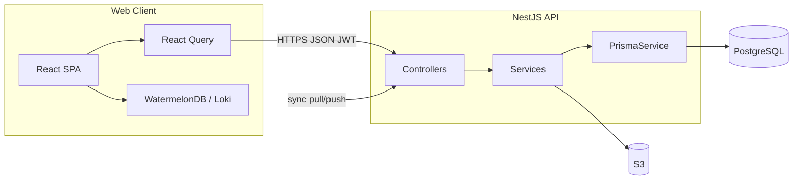

# Construction Connect — Technical Documentation

This document describes the **Construction Connect** monorepo: a construction procurement and supply-chain web application backed by a NestJS API and PostgreSQL (Prisma). It reflects the codebase as of the documented revision.

---

## 1. Project Overview

**Construction Connect** connects **contractors** (buyers) and **suppliers** in a B2B workflow:

- **Projects & BOQ** — Projects, sites, bill-of-quantity lines.
- **RFQ marketplace** — Contractors publish requests for quotation; suppliers submit bids; contractors award bids.
- **Purchase orders & deliveries** — PO lifecycle with partial deliveries (delivery notes / GRN-style line items).
- **Financials** — Invoices with VAT, PDF generation, ZATCA-oriented TLV QR data, payment proof uploads; company **wallets** and **transactions**.
- **Catalog** — Supplier **products** (“materials”) and admin **categories**.
- **Company settings** — JSON blobs for notifications, catalog, admin config per company.
- **Sync** — WatermelonDB-style pull/push for offline-first clients (scoped; see [Sync](#63-sync-module)).
- **Daily logs** — Site daily logs with JSON fields and photo uploads (mobile-oriented).
- **Admin** — Category management, audit log viewer API.
- **Notifications** — In-app notification list and mark-read.

The **frontend** is a React (Vite) SPA with role-aware navigation, React Query, Axios, optional local WatermelonDB sync, and i18n (EN/AR).

The **mobile** app directory exists but is currently a **minimal Expo/NativeWind stub** (welcome screen only); prior daily-log/marketplace code paths appear removed or in flux per repository state.

---

## 2. Tech Stack

| Layer | Technology |
|--------|-------------|
| **Backend** | NestJS 11, Node.js, TypeScript |
| **HTTP** | Express (via `@nestjs/platform-express`), Helmet, CORS, `@nestjs/throttler` (default 100 req/min per IP) |
| **Auth** | JWT (`passport-jwt`), bcrypt for passwords and OTP hashes |
| **Database** | PostgreSQL, Prisma 7 ORM (`@prisma/client`, `@prisma/adapter-pg`) |
| **Storage** | AWS S3 (`@aws-sdk/client-s3`, presigned URLs) for uploads/PDFs |
| **Email/SMS** | Nodemailer, Twilio (OTP delivery — see `OtpDeliveryService`) |
| **PDF / QR** | `pdfkit`, `qrcode`; ZATCA Phase 1–style TLV helper (`buildZatcaPhase1TlvBase64`) |
| **Health** | `@nestjs/terminus` — `GET /health-check` (DB + disk) |
| **Frontend** | React 18, Vite 5, TypeScript, Tailwind CSS, shadcn/ui (Radix), TanStack React Query v5, React Router v6, Axios, react-i18next, WatermelonDB + LokiJS adapter (IndexedDB) |
| **Testing** | Backend: Jest, Supertest e2e; Frontend: Vitest, Testing Library |

**Environment (typical)**

- Backend: `PORT`, `DATABASE_URL`, `JWT_SECRET`, `FRONTEND_URL` (CORS), S3 and mail/SMS-related variables (see `backend/.env.example`).
- Frontend: `VITE_API_URL` (defaults to `http://localhost:3000`).

---

## 3. Features Breakdown (by Module)

### 3.1 Authentication & onboarding

- **Register** — Creates `Company` + `User` with `PENDING_VERIFICATION`, hashes password and 6-digit OTP, sends OTP via `OtpDeliveryService`, returns `userId` (no JWT until verified).
- **Verify OTP** — Validates OTP window, sets user `ACTIVE`, clears OTP fields, returns JWT + user (same shape as login).
- **Login** — Email/password; requires `ACTIVE` status; returns `access_token` and user (sensitive fields stripped in service).
- **Profile** — `GET /auth/profile` returns JWT payload / user from request.

**JWT payload (`JwtPayload`)**: `sub`, `email`, `companyId`, `role` (`CONTRACTOR` | `SUPPLIER` | `ADMIN`), optional `companyCountry`. Role is derived in `buildJwtPayload` from company type and whether the user is a platform admin without a company.

### 3.2 Users & companies

- **Users** — CRUD (create restricted to `ADMIN`); list/scope rules in `UsersService`; `PATCH /users/push-token` for device push tokens.
- **Companies** — CRUD; **KYB-style** fields (`commercial_reg_no`, `tax_id`, `is_verified`); document upload to S3; **verify** endpoint for `ADMIN`.

### 3.3 Projects, sites, BOQ

- **Projects** — Owned by `company_id` (contractor); budget and dates.
- **Sites** — Geolocation, optional geofence JSON, contacts.
- **BOQ items** — Hierarchical CSI-style lines with optional parent/child.

### 3.4 RFQs & bids

- **RFQ** — Linked to project and creator; status `OPEN` | `CLOSED` | `AWARDED`; items optionally tied to BOQ lines; attachments to S3.
- **Bids** — Suppliers submit bids with line items (`BidItem` per `RFQItem`); contractor can **award** or **reject** (with reason).
- **Notifications** — RFQ/bid events notify relevant users via `NotificationsService`.

### 3.5 Purchase orders & delivery

- **PO** — Links project, supplier, optional bid/RFQ; `POStatus` workflow (`CONFIRMED` → … → `COMPLETED` / `CANCELLED`).
- **Status updates** — Role-aware transitions (supplier vs buyer) in `PurchaseOrdersService`.
- **Delivery notes** — Partial quantities per `POItem` (`GRNItem`); POD image/signature URLs; can trigger **invoice creation** when PO reaches `DELIVERED` (see invoices).
- **Wallets** — On certain transitions, ledger movements may be recorded (`WalletsService` integration in PO service).

### 3.6 Invoices & compliance

- **CRUD** invoices with buyer/supplier companies, VAT fields, ZATCA-related fields (UUID, hashes, QR data).
- **Auto invoice** — `InvoicesService.createOnPoDelivered` when PO status is `DELIVERED` (idempotent per PO).
- **PDF** — Generated to S3; `GET /invoices/:id/pdf` returns a **signed URL**.
- **Payment proof** — Upload file to S3, optional reference/notes.

### 3.7 Materials (product catalog)

- **Public listing** (authenticated) — Filter by category, supplier, search; maps to `Product` model.
- **Supplier** — Create/update products; delete is soft (`is_active: false`).

### 3.8 Wallets & transactions

- Per-company `Wallet` with `Transaction` rows (`DEPOSIT`, `WITHDRAWAL`, `PAYMENT`, `REFUND`); optional links to invoice/PO.
- Endpoints scoped by `companyId` with `ForbiddenException` if JWT user’s company does not match (unless `ADMIN`).

### 3.9 Settings

- `CompanySettings` — `notifications`, `catalog`, `admin` JSON columns; get/patch by `companyId` with same company check.

### 3.10 Sync

- **Pull** — Returns Watermelon-shaped changes for **projects** and **sites** the user’s company can see, filtered by `last_pulled_at` (timestamp in ms). Uses numeric timestamps for client schema.
- **Push** — Applies batched creates/updates/deletes in a Prisma transaction; **products** from mobile are skipped (server catalog of record). Includes sanitization and PO-side effects for daily logs, etc. (see `SyncService`).

### 3.11 Daily logs

- **CRUD**-style API for `DailyLog` (weather, attendance JSON, materials, progress notes, status).
- **Photos** — `LogPhoto` records; upload file to S3 bound to `log_photo_id`.

### 3.12 Admin

- **Categories** — Tree (`Category` model) with `unit_options`; full CRUD.
- **Audit logs** — Paginated/filtered read from `AuditLog` (see [Audit](#711-audit)).

### 3.13 Notifications

- List with optional `unread=true`, limit; mark one or all read.

---

## 4. System Architecture

### 4.1 High-level diagram

### 4.2 Backend structure (NestJS modular)

- **`app.module.ts`** — Imports feature modules; registers global **ThrottlerGuard**, **JwtAuthGuard**, **RolesGuard**, **AuditInterceptor**, **HttpExceptionFilter**.
- **Feature modules** — Each domain (`auth`, `users`, `companies`, `projects`, `rfqs`, `purchase-orders`, `invoices`, `sync`, `settings`, `wallets`, `materials`, `daily-logs`, `admin`, `notifications`, `health`) provides controllers + services.
- **Cross-cutting**
  - `common/decorators` — `@Public()`, `@Roles()`, `@CurrentUser()`.
  - `common/guards` — JWT (skips `@Public()`), roles (optional per-handler).
  - `common/filters` — Standardized HTTP exceptions.
  - `common/interceptors/audit.interceptor.ts` — Logs mutating requests to `AuditLog` when user has `sub` and `companyId` (platform admins without company may not write audit rows).
  - `storage/` — S3 uploads and signed URLs.

**Pattern**: **Layered / modular monolith** — Controllers are thin; business rules live in services; Prisma is the persistence adapter. Not full “clean architecture” (no strict domain/use-case folders), but clear separation per module.

### 4.3 Frontend architecture

- **Entry** — `main.tsx` → `App.tsx`.
- **Routing** — `react-router-dom` with public routes (`/login`, `/register`, `/auth/verify-otp`) and a `ProtectedRoute` wrapper for authenticated app routes.
- **Providers (outer → inner)** — `DatabaseProvider` (WatermelonDB) → `QueryClientProvider` → `BrowserRouter` → `SyncProvider` → `AuthProvider` → `LanguageProvider` → `TooltipProvider`.
- **API** — Shared Axios instance (`lib/api.ts`) with `Authorization: Bearer` from `localStorage` and 401 redirect to `/login`.
- **Offline sync** — `lib/sync.ts` uses Watermelon `synchronize()` against `/sync/pull` and `/sync/push`; `SyncContext` tracks online/offline and triggers sync on reconnect.
- **UI** — Page components under `pages/`, reusable building blocks under `components/` (including `components/ui/*` for design system).
- **i18n** — `LanguageContext` + JSON locales (`locales/en.json`, `locales/ar.json`).

### 4.4 State management

| Concern | Mechanism |
|--------|-----------|
| **Auth user** | React Context (`AuthContext`) + `localStorage` (`user`, `access_token`) |
| **Server data** | TanStack React Query (where used on pages) |
| **Offline DB** | WatermelonDB models (projects, RFQs, POs, etc.) for sync |
| **UI** | Local component state; toasts (shadcn + Sonner) |

No Redux/Zustand global store; auth and sync are the main shared client state.

---

## 5. Database Schema (Prisma)

**Core entities and relations (summary)**

- **`Company`** — Type `CONTRACTOR` | `SUPPLIER`; wallet balance; relations: users, projects (contractor), bids, POs as supplier, products, invoices both sides, wallets, settings, documents.
- **`User`** — Email unique; `Role` enum (`ADMIN`, `SITE_ENGINEER`, `PROCUREMENT_MANAGER`); `UserStatus`; OTP fields; `push_token`; links to RFQs created, delivery notes received, sync changes, daily logs, notifications.
- **`Project`** → **`Site`**, **`BOQItem`**, **`RFQ`**, **`PurchaseOrder`**, **`DailyLog`**, **`Inventory`**.
- **`RFQ`** → **`RFQItem`**, **`Bid`**, **`RFQAttachment`**; optional **`awarded_bid_id`**.
- **`Bid`** → **`BidItem`** (links to `RFQItem`).
- **`PurchaseOrder`** → **`POItem`** → **`GRNItem`** via **`DeliveryNote`**.
- **`Invoice`** — Buyer/supplier companies; optional `po_id`; ZATCA-oriented fields; PDF key; **`Transaction`** links.
- **`Wallet`** / **`Transaction`** — Ledger per company.
- **`Product`** — Supplier catalog; **`Category`** — hierarchical catalog taxonomy with `unit_options`.
- **`CompanySettings`** — 1:1 with company, JSON columns.
- **`AuditLog`** — Immutable-style audit rows.
- **`SyncChange`** — Optional server log of sync operations (pull implementation also queries domain tables directly).
- **`DailyLog`** / **`LogPhoto`** — Site reporting.

Enums: `CompanyType`, `Role`, `UserStatus`, `RFQStatus`, `BidStatus`, `POStatus`, `DeliveryStatus`, `InvoiceStatus`, `TransactionType`, `PaymentTerm`, `SyncOperation`, `DailyLogStatus`.

---

## 6. API Endpoints

**Conventions**

- **Base URL**: no global prefix (e.g. `http://localhost:3000`).
- **Auth**: Unless marked **Public**, endpoints require `Authorization: Bearer <JWT>`.
- **Throttling**: Global limiter; `auth` login/register/verify use stricter limits (5/min).
- **Roles**: `@Roles('ADMIN' | 'CONTRACTOR' | 'SUPPLIER')` where noted; omitted = any authenticated role (subject to service-level checks).

### 6.1 Root & health

| Method | Route | Auth | Purpose |
|--------|--------|------|---------|
| GET | `/` | JWT | Hello string from `AppService` |
| GET | `/health` | **Public** | `{ status, timestamp }` |
| GET | `/health-check` | **Public**, no throttle | Terminus: DB ping + disk space |

### 6.2 Auth (`/auth`)

| Method | Route | Body / params | Response (typical) | Notes |
|--------|--------|----------------|-------------------|--------|
| POST | `/auth/register` | `{ email, password, phone?, fullName?, companyName, role: 'contractor'\|'supplier', crNumber?, taxId? }` | `{ message, userId }` | **Public**. Maps role to `CompanyType`; first user role `ADMIN` in Prisma. |
| POST | `/auth/verify-otp` | `{ userId, otp }` | `{ access_token, user }` | **Public** |
| POST | `/auth/login` | `{ email, password }` | `{ access_token, user }` | **Public** |
| GET | `/auth/profile` | — | JWT user / payload | Authenticated |

### 6.3 Users (`/users`)

| Method | Route | Body / params | Roles |
|--------|--------|----------------|------|
| POST | `/users` | Prisma `UserCreateInput` | `ADMIN` |
| GET | `/users` | — | Scoped in service |
| GET | `/users/:id` | — | Scoped |
| PATCH | `/users/push-token` | `{ push_token }` | — |
| PATCH | `/users/:id` | Prisma `UserUpdateInput` | Scoped |
| DELETE | `/users/:id` | — | Scoped |

### 6.4 Companies (`/companies`)

| Method | Route | Body / params | Notes |
|--------|--------|----------------|--------|
| POST | `/companies` | Prisma create | `ADMIN` |
| GET | `/companies` | — | Scoped |
| GET | `/companies/:id` | — | |
| PATCH | `/companies/:id` | Prisma update | |
| DELETE | `/companies/:id` | — | |
| POST | `/companies/:id/documents` | `multipart`: `file`, `doc_type` | `CONTRACTOR`, `SUPPLIER`, `ADMIN`; max ~25MB |
| PATCH | `/companies/:id/verify` | — | `ADMIN` |

### 6.5 Projects (`/projects`)

| Method | Route | Body / params |
|--------|--------|----------------|
| POST | `/projects` | Prisma `ProjectCreateInput` |
| GET | `/projects` | — |
| GET | `/projects/:id` | — |
| PATCH | `/projects/:id` | Prisma update |
| DELETE | `/projects/:id` | — |
| POST | `/projects/sites` | Prisma `SiteCreateInput` |
| POST | `/projects/boqs` | Prisma `BOQItemCreateInput` |

**Note**: `GET /projects/:id` is registered before static paths; avoid using IDs that collide with reserved words if more routes are added.

### 6.6 RFQs (`/rfqs`)

| Method | Route | Body / params | Roles |
|--------|--------|----------------|--------|
| POST | `/rfqs` | Prisma `RFQCreateInput` | `CONTRACTOR`, `ADMIN` |
| GET | `/rfqs` | — | Scoped (contractor vs supplier vs admin) |
| POST | `/rfqs/items` | Prisma `RFQItemCreateInput` | `CONTRACTOR`, `ADMIN` |
| POST | `/rfqs/:id/bids` | Prisma `BidCreateInput` | `SUPPLIER` |
| GET | `/rfqs/:id/bids` | — | |
| PATCH | `/rfqs/:rfqId/award/:bidId` | — | `CONTRACTOR`, `ADMIN` |
| PATCH | `/rfqs/:rfqId/bids/:bidId/reject` | `{ rejection_reason }` | `CONTRACTOR`, `ADMIN` |
| POST | `/rfqs/:id/attachments` | `multipart` file | `CONTRACTOR`, `ADMIN`; max ~50MB |
| GET | `/rfqs/:id` | — | |
| PATCH | `/rfqs/:id` | Prisma update | |
| DELETE | `/rfqs/:id` | — | |

### 6.7 Purchase orders (`/purchase-orders`)

| Method | Route | Body / params |
|--------|--------|----------------|
| POST | `/purchase-orders` | Prisma `PurchaseOrderCreateInput` |
| GET | `/purchase-orders` | — |
| GET | `/purchase-orders/:id` | — |
| PATCH | `/purchase-orders/:id` | Prisma update |
| PATCH | `/purchase-orders/:id/status` | `{ status: POStatus, note? }` |
| DELETE | `/purchase-orders/:id` | — |
| POST | `/purchase-orders/:id/delivery-notes` | See controller: `delivery_date`, `status`, POD URLs, `received_by`, `items[]` |
| GET | `/purchase-orders/:id/delivery-notes` | — |

### 6.8 Invoices (`/invoices`)

| Method | Route | Body / params |
|--------|--------|----------------|
| POST | `/invoices` | Prisma `InvoiceCreateInput` |
| GET | `/invoices` | — |
| GET | `/invoices/:id` | — |
| GET | `/invoices/:id/pdf` | — | Returns signed URL payload for PDF |
| POST | `/invoices/:id/payment-proof` | `multipart` + optional `referenceNumber`, `notes` |
| PATCH | `/invoices/:id` | Prisma update |
| DELETE | `/invoices/:id` | — |

### 6.9 Sync (`/sync`)

| Method | Route | Query / body | Response |
|--------|--------|----------------|----------|
| GET | `/sync/pull` | `last_pulled_at` (ms timestamp) | `{ changes: { projects, sites }, timestamp }` |
| POST | `/sync/push` | WatermelonDB `changes` object (or `{ changes }`) | Processed in transaction |

### 6.10 Settings (`/settings`)

| Method | Route | Body |
|--------|--------|------|
| GET | `/settings/company/:companyId` | — |
| PATCH | `/settings/company/:companyId` | `{ notifications?, catalog?, admin? }` |

### 6.11 Wallets (`/wallets`)

| Method | Route | Notes |
|--------|--------|--------|
| GET | `/wallets/company/:companyId` | |
| GET | `/wallets/company/:companyId/summary` | |
| GET | `/wallets/company/:companyId/transactions` | |
| GET | `/wallets/transactions` | `companyId` or `walletId` query; non-admin needs `companyId` |
| GET | `/wallets/transactions/:id` | |
| POST | `/wallets/transactions` | Prisma `TransactionCreateInput`; wallet access checked for non-admin |

### 6.12 Materials (`/materials`)

| Method | Route | Query / body |
|--------|--------|----------------|
| GET | `/materials` | `category`, `supplierId`, `search` |
| GET | `/materials/:id` | — |
| POST | `/materials` | Product DTO | `SUPPLIER` |
| PATCH | `/materials/:id` | DTO | `SUPPLIER` |
| DELETE | `/materials/:id` | Soft delete | `SUPPLIER` |

### 6.13 Daily logs (`/daily-logs`)

| Method | Route | Query / body |
|--------|--------|----------------|
| POST | `/daily-logs` | Prisma `DailyLogCreateInput` |
| GET | `/daily-logs` | `project_id`, `date` |
| GET | `/daily-logs/:id` | — |
| PATCH | `/daily-logs/:id` | Prisma update |
| POST | `/daily-logs/photos` | `multipart` + `log_photo_id` |
| DELETE | `/daily-logs/photos/:photoId` | — |

### 6.14 Admin (`/admin`)

All routes: `@Roles('ADMIN')`.

| Method | Route |
|--------|--------|
| GET | `/admin/categories` |
| POST | `/admin/categories` |
| PATCH | `/admin/categories/:id` |
| DELETE | `/admin/categories/:id` |
| GET | `/admin/audit-logs` | `page`, `limit`, `entity_type`, `from`, `to` |

### 6.15 Notifications (`/notifications`)

| Method | Route | Query |
|--------|--------|--------|
| GET | `/notifications` | `unread`, `limit` |
| POST | `/notifications/mark-read/:id` | — |
| POST | `/notifications/mark-all-read` | — |

---

## 7. Data Flow (End-to-End)

### 7.1 Typical authenticated request (web)

1. User signs in → `POST /auth/login` → JWT stored in `localStorage`; user mapped in `AuthContext` (contractor/supplier/admin from company type).
2. React pages call `api.get/post/...` → Axios attaches `Authorization`.
3. **JwtAuthGuard** validates token; **RolesGuard** checks `@Roles` if present.
4. Controller delegates to **Service** → **Prisma** → PostgreSQL.
5. On successful **POST/PATCH/DELETE**, **AuditInterceptor** may insert `AuditLog` (requires both `user.sub` and `user.companyId`).
6. Response JSON returned to React Query or local state; errors normalized by **HttpExceptionFilter**.

### 7.2 RFQ → PO → delivery → invoice

1. Contractor creates **RFQ** + items → suppliers see RFQs in scoped `findAll`.
2. Supplier submits **Bid** → contractor compares → **award** sets RFQ `AWARDED` and bid `ACCEPTED`.
3. **PurchaseOrder** created (manually or via flows linking `bid_id` / `rfq_id`).
4. Supplier/buyer advance **PO status** per allowed transitions; **delivery notes** record partial receipts.
5. When PO becomes **`DELIVERED`**, `InvoicesService.createOnPoDelivered` can create an **invoice**, compute VAT, TLV QR, store PDF in S3.
6. Buyer/supplier use **invoice** endpoints and optional **payment proof** upload; **wallet** transactions may align with payments depending on service logic.

### 7.3 Watermelon sync

1. Client maintains local DB; on sync, **pull** fetches projects/sites changed after `last_pulled_at`.
2. **push** sends created/updated/deleted records per table; server transaction applies creates/updates with sanitization; **products** from client are ignored.

---

## 8. Function-Level Explanation (Services & Key Flows)

This section summarizes **public/service methods** and responsibilities. Private helpers are omitted unless critical.

### 8.1 `AuthService`

| Function | Input | Output | Behavior |
|----------|--------|--------|----------|
| `validateUser` | email, password | User or null | bcrypt compare; requires `ACTIVE` |
| `login` | user / user id | `{ access_token, user }` | Builds JWT via `buildJwtPayload`, strips secrets |
| `register` | email, password, role, company… | `{ message, userId }` | Creates company + pending user, sends OTP; rolls back on failure |
| `verifyOtp` | userId, otp | Same as login | Expiry check, bcrypt verify, activate user |

### 8.2 `UsersService` / `CompaniesService`

- **CRUD** with **company scoping**: users and companies are filtered or forbidden based on `JwtPayload.companyId` and `role === 'ADMIN'`.
- **Companies**: `uploadDocument` sends buffer to S3; `verifyCompany` sets `is_verified`.

### 8.3 `ProjectsService`

- Ensures project ownership for contractors; creates **sites** and **BOQ** lines with project access checks.

### 8.4 `RFQsService`

| Area | Behavior |
|------|----------|
| `create` / `update` / `remove` | Project must belong to contractor’s company unless admin |
| `findAll` | Contractors: own projects’ RFQs; suppliers: RFQs open to them; admin: all |
| `createBid` | Supplier company; validates RFQ open and targeting |
| `awardBid` / `rejectBid` | Sets RFQ/bid status; may create notifications |
| `addAttachment` | S3 upload + `RFQAttachment` row |

### 8.5 `PurchaseOrdersService`

| Area | Behavior |
|------|----------|
| `create` | Buyer or supplier on the PO’s parties, or admin |
| `findAll` | Buyer (via project company) OR supplier |
| `updateStatus` | Validates transition by role; may notify; on `DELIVERED` triggers invoice creation and wallet logic |
| `createDeliveryNote` | Validates quantities, updates PO/items, may update PO status |

### 8.6 `InvoicesService`

- `create`, `findAll`, `findOne`, `update`, `remove` with buyer/supplier access rules.
- `createOnPoDelivered` — Idempotent invoice from PO totals and country-based VAT.
- `getPdfSignedUrl` — Resolves S3 key to short-lived URL.
- `uploadPaymentProof` — Stores file, updates invoice metadata.

### 8.7 `SyncService`

- `pullChanges` — Projects/sites for `user.companyId`, filtered by timestamp; maps to client shape.
- `pushChanges` — Ordered table processing, `sanitizeForPrisma`, special cases for `daily_logs`, PO updates from mobile delivery data, etc.

### 8.8 `DailyLogsService`

- Scoped by project membership; photo upload resolves `LogPhoto` and writes S3 URL.

### 8.9 `MaterialsService`

- `findAll` / `findOne` — Active products with supplier summary.
- `create` / `update` / `remove` — Supplier-only; `remove` soft-deletes.

### 8.10 `WalletsService`

- Finds or creates wallet by company; lists transactions; `createTransaction` for ledger entries (used by PO/invoice flows as applicable).

### 8.11 `SettingsService`

- Get/upsert `CompanySettings` JSON sections.

### 8.12 `AdminService`

- Category CRUD; paginated `AuditLog` with filters.

### 8.13 `NotificationsService`

- Creates in-app rows; list/mark read for `user.sub`.

### 8.14 `AuditInterceptor`

- After mutating methods, persists audit row with action string, entity type from path, optional `new_value` from response body.

---

## 9. Frontend Routes (SPA)

| Path | Page / purpose |
|------|----------------|
| `/login`, `/register`, `/auth/verify-otp` | Auth |
| `/onboarding` | Onboarding |
| `/` | Dashboard (`Index`) |
| `/rfqs`, `/rfqs/new` | RFQ list & builder |
| `/bids` | Bid comparison |
| `/orders`, `/orders/:id` | Orders & detail |
| `/projects` | Projects |
| `/suppliers` | Suppliers |
| `/approvals` | Approvals |
| `/settings` | Settings & admin entry |
| `/supplier/rfq-feed` | Supplier RFQ feed |
| `/financials` | Financials |
| `/admin/audit-logs` | Audit log viewer |

**Navigation** (`AppSidebar`): Dashboard, RFQs, Orders, Suppliers, Financials, Projects; admin: Settings & Audit Logs. Additional routes exist (e.g. Bids, Approvals) depending on product navigation elsewhere (`MobileNav`, in-page links).

---

## 10. Important Patterns & Conventions

- **Modular NestJS** — One module per bounded context; dependency injection throughout.
- **JWT + role metadata** — `AppRole` is coarse (contractor/supplier/admin); finer Prisma `Role` on `User` exists for future RBAC.
- **Defense in depth** — Guards plus explicit `ForbiddenException` checks in services.
- **Audit trail** — HTTP interceptor + `AuditLog` model; not a full event-sourcing system.
- **File uploads** — Multer memory storage → S3 via `StorageService`.
- **Idempotency** — Invoice creation on PO delivered; wallet operations should be checked per call sites.
- **Frontend** — Composition with shadcn/Radix; design tokens in CSS; bilingual support.

---

## 11. Observations & Improvements

### 11.1 Gaps / incomplete areas

- **Mobile app**: Only a placeholder tab screen; prior features (daily log, marketplace) are not present in the current tree despite API and schema support.
- **TODO/FIXME markers**: No `TODO`/`FIXME` comments found in `*.ts`/`*.tsx` sources; product gaps are architectural rather than tagged.
- **Sync**: Pull is limited to **projects** and **sites**; push handles many tables — ensure client and server schemas stay aligned to avoid drift.
- **Audit log**: Users **without** `companyId` (e.g. platform admin) may not generate interceptor audit rows (`user.companyId` check).

### 11.2 Routing / API design notes

- **Nest route ordering**: Static segments like `/projects/sites` are defined after `/projects/:id`; **GET** `/projects/sites` would incorrectly resolve `:id = "sites"` if such a request were made. Prefer registering static paths before parameterized routes or use a prefix (e.g. `/projects/sites` module).
- **Materials GET**: Authenticated but not supplier-only — appropriate for catalog browsing.
- **Root `GET /`**: Requires JWT (not `@Public`), which may surprise health checks; use `/health` or `/health-check` for monitoring.

### 11.3 Security & operations

- Rotate **`JWT_SECRET`** in production; default in `JwtStrategy` is development-only.
- Configure **CORS** (`FRONTEND_URL`) and **S3** bucket policies.
- **Throttling** is global; tune for high-traffic deployments.

### 11.4 Testing

- Backend includes **e2e** tests (`test/*.e2e-spec.ts`) for security, storage, notifications, PO status, etc.
- Frontend has selective tests (e.g. `BidComparisonTable.test.tsx`, `Bids.test.tsx`).

---

## 12. File Map (Quick Reference)

| Area | Location |
|------|----------|
| Backend entry | `backend/src/main.ts`, `backend/src/app.module.ts` |
| Prisma schema | `backend/prisma/schema.prisma` |
| Frontend entry & routes | `frontend/src/App.tsx` |
| API client | `frontend/src/lib/api.ts` |
| Watermelon sync | `frontend/src/lib/sync.ts`, `frontend/src/model/` |
| Auth context | `frontend/src/contexts/AuthContext.tsx` |

---

*This document was generated from static analysis of the repository; runtime configuration and deployed infrastructure may differ.*
